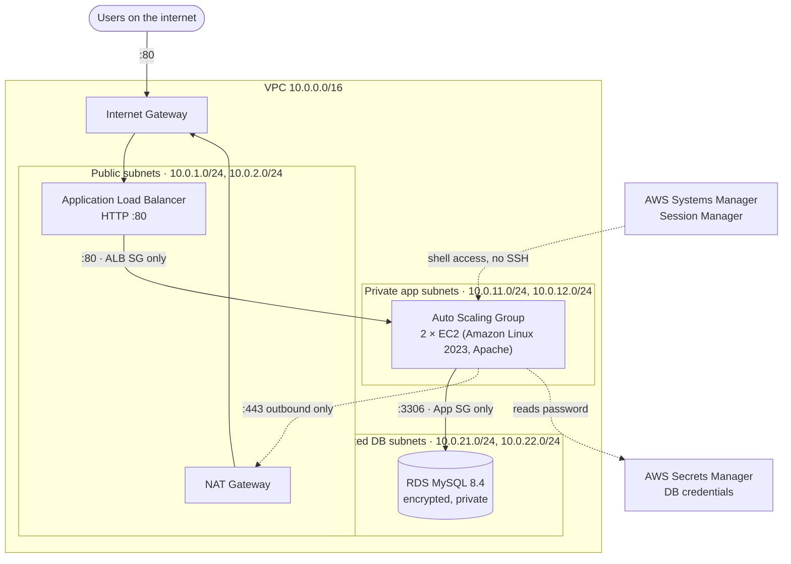

# AWS Three-Tier Architecture with Terraform

A highly available three-tier web architecture on AWS, written entirely as Infrastructure as Code with Terraform and split into reusable modules.

One `terraform apply` builds 39 resources across two Availability Zones: a public load balancer, an auto-scaling app tier in private subnets, and an encrypted MySQL database in isolated subnets. One `terraform destroy` removes all of it.


---

## Architecture



Every tier is deployed across **two Availability Zones** (`us-east-1a`, `us-east-1b`).

| Tier | Runs in | Reachable from |
|---|---|---|
| **Web**: Application Load Balancer | Public subnets | The internet, port 80 |
| **App**: EC2 instances in an Auto Scaling Group | Private subnets | The ALB only, port 80 |
| **Data**: RDS MySQL | Isolated subnets (no internet route) | The app tier only, port 3306 |

---

## Design decisions

These are the choices I made and why.

**Security groups are chained by reference, not by IP range.**
The app tier accepts traffic only from resources carrying the ALB's security group, and the database only from the app tier's. Auto Scaling replaces instances and their IPs change, but the references stay valid. Rules are separate `aws_vpc_security_group_*_rule` resources, which avoids the circular dependency between the ALB and app groups.

**No SSH, no bastion host, no key pairs.**
Instances are reached through AWS Systems Manager Session Manager. The SSM agent opens an outbound HTTPS connection through the NAT gateway, so no inbound port is open and there are no keys to leak. Access is controlled by IAM.

**The database password never appears in code or state.**
RDS generates the master password and stores it in Secrets Manager (`manage_master_user_password = true`). A `sensitive` variable would still write the password to the state file in plain text. The app servers read the secret through an IAM policy scoped to that one secret ARN.

**The database has three independent layers of isolation.**
No public IP (`publicly_accessible = false`), a route table with no internet route, and a security group that admits only the app tier.

**Health checks are application-level.**
The ASG uses `health_check_type = "ELB"`, so an instance that is running but serving errors is replaced, not just one that has stopped. A 300-second grace period stops the ASG from killing instances while they are still installing software.

**Remote state with native locking.**
State lives in a versioned, encrypted S3 bucket with S3 native locking (`use_lockfile = true`), so no DynamoDB table is needed. Backend settings are kept out of Git with a partial backend configuration (`backend.hcl`).

**Inputs are validated at plan time.**
`project_name` and `environment` have `validation` blocks, so a name that would exceed AWS limits fails at `plan` instead of partway through `apply`.

**Other hardening.**
IMDSv2 is enforced on instances, RDS storage is encrypted, subnets don't auto-assign public IPs, and every resource is tagged with `Project`, `Environment` and `ManagedBy` through provider `default_tags`.

---

## Project structure

```
.
├── main.tf              # Wires the modules together
├── moved.tf             # Refactor record: flat resources → module addresses
├── variables.tf         # Project settings, with validation
├── outputs.tf           # ALB URL, DB endpoint, secret ARN, IDs
├── providers.tf         # AWS provider + default tags
├── versions.tf          # Terraform/provider versions, S3 backend
├── backend.hcl.example  # Template for the (git-ignored) backend config
└── modules/
    ├── network/         # VPC, 6 subnets, IGW, NAT gateway, route tables
    ├── security/        # 3 security groups, 6 rules
    ├── alb/             # Load balancer, target group, listener
    ├── database/        # DB subnet group, RDS MySQL
    └── compute/         # IAM role, launch template, Auto Scaling Group
```

Modules never reference each other directly. The root module passes outputs from one module into the inputs of the next:

```
network ──► security ──► alb ──► compute
   │            │                    ▲
   └────────────┴──► database ───────┘
```

---

## How to deploy

### Prerequisites
- Terraform 1.10 or later
- AWS CLI v2
- An IAM user with permission to create these resources
- Credentials available as environment variables (`AWS_ACCESS_KEY_ID`, `AWS_SECRET_ACCESS_KEY`, `AWS_REGION`)

### 1. Create the state bucket (one time)

```bash
ACCOUNT_ID=$(aws sts get-caller-identity --query Account --output text)
BUCKET="tfstate-3tier-${ACCOUNT_ID}"
aws s3api create-bucket --bucket "$BUCKET" --region us-east-1
aws s3api put-bucket-versioning --bucket "$BUCKET" --versioning-configuration Status=Enabled
```

### 2. Configure the backend

```bash
cp backend.hcl.example backend.hcl
# set bucket = "tfstate-3tier-<your account id>"
```

### 3. Deploy

```bash
terraform init -backend-config=backend.hcl
terraform plan -out=tfplan
terraform apply tfplan
```

RDS takes about 7 minutes. Allow another 3 minutes for the instances to pass health checks.

### 4. Test

```bash
for i in {1..4}; do curl -s $(terraform output -raw alb_url) | grep -E "instance|Zone"; done
```

Responses come from two different instances in two Availability Zones.

### 5. Tear down

```bash
terraform destroy
```

---

## What I verified

- **Load balancing across AZs**: repeated requests are served by instances in `us-east-1a` and `us-east-1b`.
- **Self-healing**: I terminated an instance by hand. The site stayed up on the remaining instance, and the ASG launched a replacement automatically.
- **App-to-database path**: from an app instance (via Session Manager) I read the password from Secrets Manager and connected to MySQL 8.4.
- **Database isolation**: a connection attempt to port 3306 from outside the VPC times out.

<!-- Screenshots: add images to docs/images/ and link them here, e.g.


-->

---

## Cost

Approximate on-demand prices in `us-east-1` while everything is running:

| Resource | Approx. cost |
|---|---|
| NAT Gateway | ~$0.045 / hour + data processing |
| Application Load Balancer | ~$0.0225 / hour + LCUs |
| 2 × t3.micro | ~$0.021 / hour |
| RDS db.t4g.micro + 20 GB gp3 | ~$0.016 / hour + storage |
| Public IPv4 addresses | ~$0.005 / hour each |

That's roughly **$2.50–3 per day**. I deploy only while working on the project and run `terraform destroy` at the end of every session. A $10 AWS Budgets alert is the safety net.

---

## Production improvements

Choices made to keep a learning environment cheap, and what I'd change for production:

| This project | Production |
|---|---|
| One NAT gateway | One NAT gateway per AZ, so losing an AZ doesn't cut outbound access |
| RDS single-AZ | `multi_az = true` for automatic failover to a standby |
| HTTP on port 80 | HTTPS with an ACM certificate, and a redirect from 80 to 443 |
| 1-day backups, no final snapshot, no deletion protection | 7–35 day backups, final snapshot, deletion protection on |
| App tier reaches AWS services through the NAT | VPC endpoints for SSM, Secrets Manager and S3, to keep that traffic private and cut NAT costs |
| Fixed ASG size | Target-tracking scaling policies on CPU or request count |
| Manual `plan` and `apply` | A CI/CD pipeline (e.g. GitHub Actions with OIDC) running `fmt`, `validate`, `plan` on pull requests |
| No edge protection | AWS WAF on the ALB, CloudWatch alarms, ALB access logs |

---

## Lessons learned

**AWS name length limits.**
Resource names are built from `project_name` and `environment`. AWS limits ALB and target group names to 32 characters, and a long project name made `apply` fail partway through. I shortened the name, then added `validation` blocks so an invalid name now fails at `plan`, before anything is created.

**Refactoring into modules without destroying anything.**
Moving resources into modules changes their addresses in state, and without help Terraform plans to destroy and recreate them. `moved` blocks map each old address to its new one, so a refactor changes only the state, never the infrastructure.

**Recovering a stuck state lock.**
An interrupted run left a lock in S3. I confirmed nothing else was running, released it with `terraform force-unlock <lock-id>`, and then used `terraform state list` and `plan` to see what the interrupted run had left behind.

---

## Author

**Mohamed Abbad**, AWS Certified Solutions Architect – Associate
[LinkedIn](https://www.linkedin.com/in/mohamed-abbad) · [GitHub](https://github.com/medbiga)
